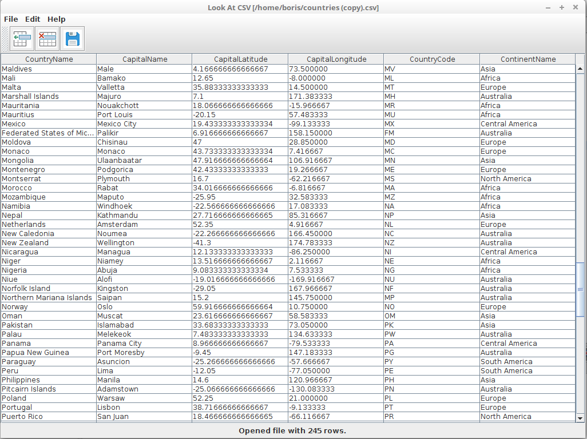

# LookAtCSV

This is small tool to view CSV file in table format. Also you can create new files, edit it's content by modifying cells, adding or deleting rows.

## How to use

Simply clone the repository and import the project in your favourite Java IDE.
`git clone https://github.com/boris-ns/LookAtCSV.git`

##### Example CSV files
Few example .csv files are located in `csv_test_files` folder.

### Screenshots

### TODO

These are some things that would be cool if this program had.
Feel free to contribute :)

- [ ] Undo/Redo options
- [ ] Add tabs (multiple files opened at once)
- [ ] Add and delete columns
- [ ] Search
- [ ] Export to JSON or XML